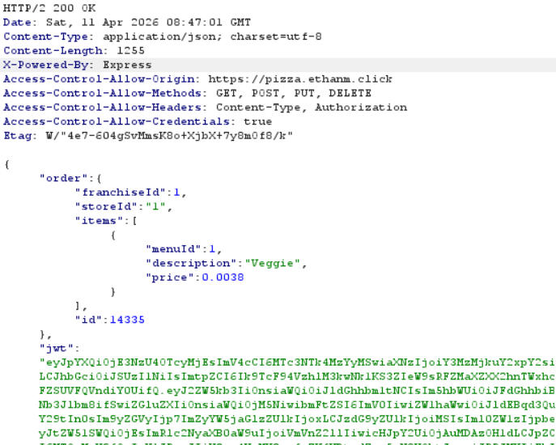

| Item | Result |
| -------- | -------- |
| Date   | April 10, 2026   |
| Target   | pizza.ethanm.click   |
| Classification | Client-Side Price Manipulation |
| Severity | 1 |
| Description | Price sent in Client-side request. Able to be modified via Burpsuite before payment. Pizzas ordered for free. |
| Images |  |
| Corrections | In order router, added a new function that rather than taking the request body, checks that the request body matches the menu, then sends the menu item. So there is no trust in what the client sends over.  |

| Item | Result |
| -------- | -------- |
| Date   | April 11, 2026   |
| Target   | pizza.ethanm.click   |
| Classification | Information Disclosure |
| Severity | 1 |
| Description | JWT Token is exposed in order response payload. Potential misuse of tokens if intercepted. |
| Images |  |
| Corrections | Removed jwt from response body in the post api for creating an order. |

| Item | Result |
| -------- | -------- |
| Date   | April 11, 2026   |
| Target   | pizza.ethanm.click   |
| Classification | Insecure Design |
| Severity | 1 |
| Description | The api/order endpoint allows the same request to be submitted creating multiple distinct orders. No protections against delayed requests. |
| Images |  |
| Corrections | Removed jwt from response body in the post api for creating an order. |
