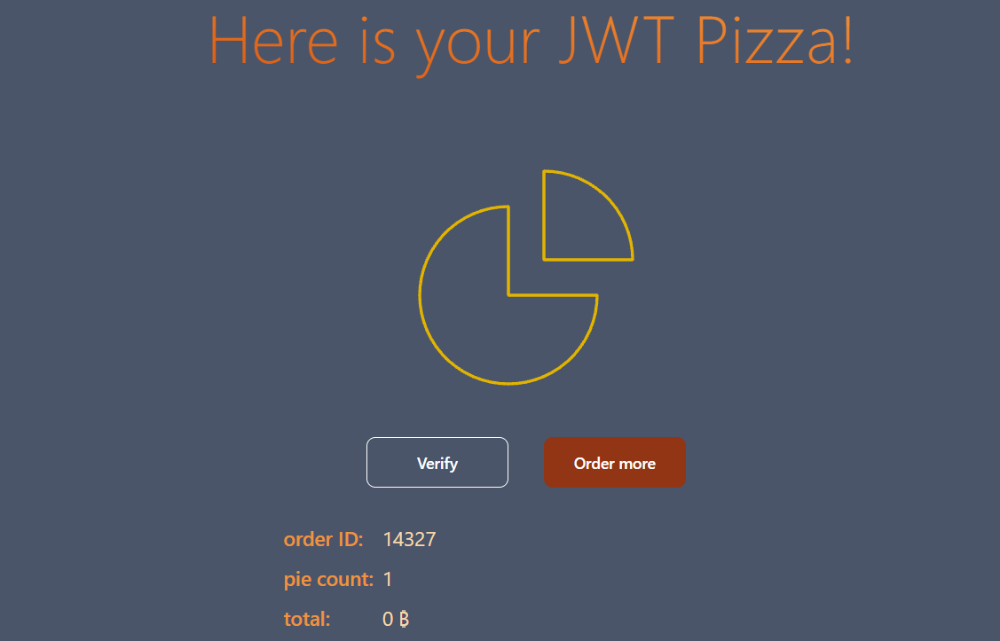
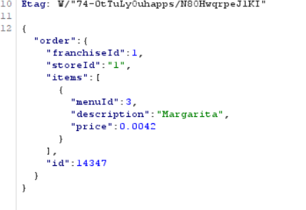
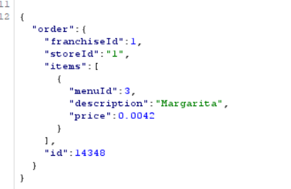
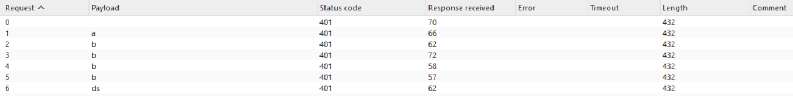
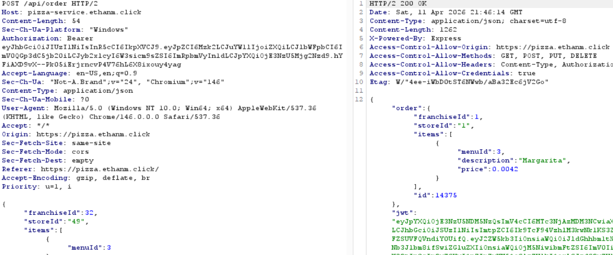
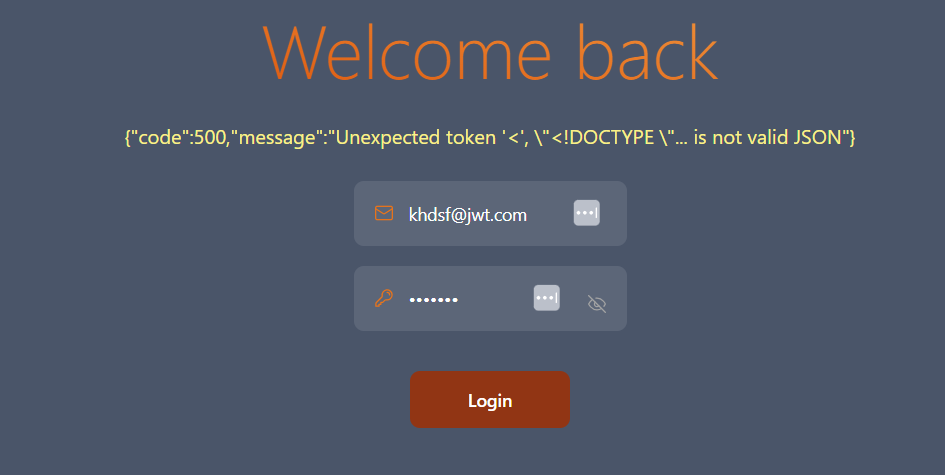
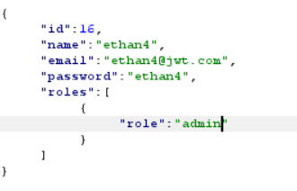
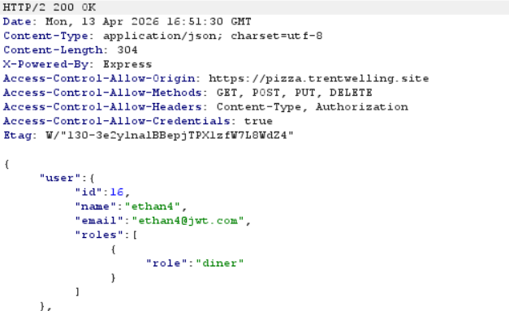
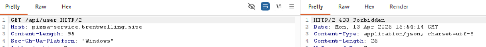

**Ethan Moreno / Trent Welling**

# Self Attacks (Ethan Moreno)

## Attack 1

| Item | Result |
| -------- | -------- |
| Date   | April 10, 2026   |
| Target   | pizza.ethanm.click   |
| Classification | Client-Side Price Manipulation |
| Severity | 1 |
| Description | Price sent in Client-side request. Able to be modified via Burpsuite before payment. Pizzas ordered for free. |
| Images |  |
| Corrections | In order router, added a new function that rather than taking the request body, checks that the request body matches the menu, then sends the menu item. So there is no trust in what the client sends over.  |

## Attack 2

| Item | Result |
| -------- | -------- |
| Date   | April 11, 2026   |
| Target   | pizza.ethanm.click   |
| Classification | Information Disclosure |
| Severity | 1 |
| Description | JWT Token is exposed in UI. Potential misuse of tokens. |
| Images | N/A |
| Corrections | Removed jwt from UI. |

## Attack 3

| Item | Result |
| -------- | -------- |
| Date   | April 11, 2026   |
| Target   | pizza.ethanm.click   |
| Classification | Insecure Design |
| Severity | 1 |
| Description | The api/order endpoint allows the same request to be submitted creating multiple distinct orders. No protections against delayed requests. |
| Images |   |
| Corrections | Added function in database.js that checks the database to see if a user has submitted a duplicate order within the last 20 seconds. In create order in orderRouter, it stops the user if this is the case. Prevents rapid order placement and overloading the system. |

## Attack 4

| Item | Result |
| -------- | -------- |
| Date   | April 11, 2026   |
| Target   | pizza.ethanm.click   |
| Classification | Injection |
| Severity | 0 |
| Description | Intercepted order requests and slightly modified auth tokens to test order verification. |
| Images |  |
| Corrections | No needed corrections. |

## Attack 5

| Item | Result |
| -------- | -------- |
| Date   | April 11, 2026   |
| Target   | pizza.ethanm.click   |
| Classification | Insecure Design |
| Severity | 1 |
| Description | Intercepted order requests and changed franchise ID, returned successful responses. This means someone can redirect payments to a different franchise. |
| Images |  |
| Corrections | Added a function in database that verifies that there exists data where the store is associated with the database. Errors if this isn't true. |

# Self Attacks (Trent Welling)

## Attack 1

| Item           | Result                                                                   |
| -------------- | ------------------------------------------------------------------------ |
| Date           | Apr 11, 2026                                                             |
| Classification | Authentication Failures                                                  |
| Severity       | 4                                                                        |
| Description    | Unchanged default credentials were used to access admin account          |
| Images         |  |
| Corrections    | Update default passwords                                                 |

## Attack 2

| Item           | Result                                                                                                                                 |
| -------------- | -------------------------------------------------------------------------------------------------------------------------------------- |
| Date           | Apr 11, 2026                                                                                                                           |
| Classification | Injection                                                                                                                              |
| Severity       | 4                                                                                                                                      |
| Description    | SQL injection successfully overwrote all emails in the database, making all accounts unusable. Could be used to execute arbitrary SQL. |
| Images         |                             |
| Corrections    | Sanitize inputs when handling the `PUT /api/user/:userId` endpoint.                                                                    |

## Attack 3

| Item           | Result                                                                                                   |
| -------------- | -------------------------------------------------------------------------------------------------------- |
| Date           | Apr 11, 2026                                                                                             |
| Classification | Security Misconfiguration                                                                                |
| Severity       | 3                                                                                                        |
| Description    | API error responses exposed internal stack traces, revealing file paths and server internals.            |
| Images         |                                          |
| Corrections    | Update global error handler to return sanitized errors in production and hide stack traces from clients. |

## Attack 4

| Item           | Result                                                                                                                                                           |
| -------------- | ---------------------------------------------------------------------------------------------------------------------------------------------------------------- |
| Date           | Apr 11, 2026                                                                                                                                                     |
| Classification | Security Misconfiguration                                                                                                                                        |
| Severity       | 3                                                                                                                                                                |
| Description    | The endpoint at 'GET /api/user' does not properly filter down users by role, only by authentication token. Retrieved a list of all users using basic login token |
| Images         |                                                                                                         |
| Corrections    | Add an explicit admin authorization check to the endpoint, returning 403 without proper permissions                                                              |

## Attack 5

| Item           | Result                                                                                                                                                                                                                                                       |
| -------------- | ------------------------------------------------------------------------------------------------------------------------------------------------------------------------------------------------------------------------------------------------------------ |
| Date           | Apr 11, 2026                                                                                                                                                                                                                                                 |
| Classification | Injection                                                                                                                                                                                                                                                    |
| Severity       | 3                                                                                                                                                                                                                                                            |
| Description    | A scripted set of SQL manipulation attempts against `GET /api/franchise` and `GET /api/user` showed malformed pagination payloads could trigger database syntax failures and internal error output. Union payloads did not return injected rows in this run. |
| Images         |                                                                                                                                                                                  |
| Corrections    | Sanitize and clamp `page`/`limit` values to integers, parameterize LIMIT/OFFSET in SQL queries, and add regression tests for malformed payloads. 

# Peer Attacks on Ethan's Site

## Attack 1

| Item           | Result                                                     |
| -------------- | ---------------------------------------------------------- |
| Date           | Apr 13, 2026                                               |
| Classification | Authentication Failures                                    |
| Severity       | 4                                                          |
| Description    | Admin default credentials were left unchanged              |
| Images         |  |

## Attack 2

| Item           | Result                                                                                                                                                  |
| -------------- | ------------------------------------------------------------------------------------------------------------------------------------------------------- |
| Date           | Apr 13, 2026                                                                                                                                            |
| Classification | Security Misconfiguration                                                                                                                               |
| Severity       | 3                                                                                                                                                       |
| Description    | The endpoint at 'DELETE /api/franchise/:franchiseId' does not properly filter down users by role, only by authentication token. Deleted all franchises. |
| Images         |                           |

## Attack 3

| Item           | Result                                                                                        |
| -------------- | --------------------------------------------------------------------------------------------- |
| Date | Apr 13, 2026 |
| Classification | Security Misconfiguration |
| Severity | 3 |
| Description | The endpoint at 'GET /api/user' does not properly filter down users by role, only by authentication token. Retrieved a list of all users, including password hashes and emails, using basic login token |
| Images |  |

## Attack 4

| Item           | Result                                                                                        |
| -------------- | --------------------------------------------------------------------------------------------- |
| Date           | Apr 13, 2026                                                                                  |
| Classification | Security Misconfiguration                                                                     |
| Severity       | 3                                                                                             |
| Description    | API error responses exposed internal stack traces, revealing file paths and server internals. |
| Images         |                                   |

## Attack 5

| Item           | Result                                                                                     |
| -------------- | ------------------------------------------------------------------------------------------ |
| Date           | Apr 13, 2026                                                                               |
| Classification | SQL Injection                                                                              |
| Severity       | 5                                                                                          |
| Description    | SQL injection overwrote all emails in database. Capable of executing arbitrary SQL queries |

# Peer Attacks on Trent's Site

## Attack 1

| Item | Result |
| -------- | -------- |
| Date   | April 12, 2026   |
| Target   | pizza.trentwelling.site   |
| Classification | Client-Side Price Manipulation |
| Severity | 1 |
| Description | Price sent in Client-side request. Able to be modified via Burpsuite before payment. Pizzas ordered for free. |
| Images |  |
| Corrections | (Not sure what to write here for now.)  |

## Attack 2

| Item | Result |
| -------- | -------- |
| Date   | April 12, 2026   |
| Target   | pizza.trentwelling.site   |
| Classification | Login SQL Injection |
| Severity | 0 |
| Description | Attempted to login with incorrect information using an SQL injection. Did not work because the parameters going into the login request were made through inputs via '?' rather than part of a string that was part of an SQL statement. It uses parameterized queries rather than string concatenation. |
| Images |  |
| Corrections | N/A |

## Attack 3

| Item | Result |
| -------- | -------- |
| Date   | April 12, 2026   |
| Target   | pizza.trentwelling.site   |
| Classification | Update User SQL Injection |
| Severity | 0 |
| Description | Attempted SQL injection to change the email of another user. This appeared more vulnerable due to using string concatenation rather than query parameterization though it did not work because the payload treated the parameters as strings. The ID used as input was found in the url/jwt rather than the query itself as well making it difficult to retrieve information my manioulating the ID. |
| Images | N/A |
| Corrections | N/A |

## Attack 4

| Item | Result |
| -------- | -------- |
| Date   | April 12, 2026   |
| Target   | pizza.trentwelling.site   |
| Classification | Insecure Design |
| Severity | 0.5 |
| Description | When making an order request, intercepted and manually changed the role to admin to test of the role would change. The role did not change, but there was also no error thrown. Appeared to be a silent failure. It showed security in that it didn't change the user though having no notice of failure when the role is being tampered with could be a potential issue. |
| Images |   |
| Corrections | (Not sure what to write here for now.) |

## Attack 5

| Item | Result |
| -------- | -------- |
| Date   | April 12, 2026   |
| Target   | pizza.trentwelling.site   |
| Classification | Identification and Authentication Failures |
| Severity | 0 |
| Description | Intercepted an order request as a user with a diner role and called an endpoint that only an admin can access. In this case I changed the endpoint to be calling the list users function to see if it'd return any data. It threw a 403 error due to that end point requiring authorization. If the endpoint did not require an authorization token, I would've been able to retrieve date, the security measure was appropriate. |
| Images |  |
| Corrections | N/A  |                                                                                                            |
| Images         |    |
